# ISA Inclusion Rules: The lNewIntr Module

## Introduction

### What is lNewIntr?

In platform trials, a key innovation is the **staggered entry of
investigational arms (ISAs)** over time. Unlike traditional trials where
all arms start simultaneously, platform trials allow new treatments to
enter as they become available. This creates important design questions:

- **When should new ISAs enter?** Immediately? After a waiting period?
  When a slot opens up?
- **How many ISAs should enter at once?** One at a time? Multiple
  simultaneously?
- **What’s the maximum capacity?** Should we limit the number of
  concurrent ISAs?

The **`lNewIntr`** module controls these inclusion rules, determining
the dynamic flow of treatments through your platform trial.

### Why It Matters

ISA inclusion timing affects:

- **Trial duration**: More frequent additions may extend the platform’s
  lifetime
- **Resource utilization**: Too many concurrent ISAs may strain
  enrollment or infrastructure
- **Decision quality**: Adequate spacing allows proper evaluation of
  each treatment
- **Operational feasibility**: Real-world platform trials must balance
  scientific goals with practical constraints

### Real-World Example

Consider a platform trial for COVID-19 therapies:

- Start with 2 promising candidates available now
- As pharmaceutical companies develop new treatments, add them when
  ready (but no more than 1 per month)
- Never run more than 5 ISAs simultaneously (enrollment capacity
  constraint)
- Continue until 10 total treatments have been evaluated or 2 years
  elapse

This vignette shows how to implement such rules using `lNewIntr`.

## Quick Start: The Helper Function

For common scenarios, use the helper function
[`lNewIntr()`](https://tgerke.github.io/simple/reference/lNewIntr.md):

``` r
# Create inclusion rules: start with 2 ISAs, add new ones as old ones finish, max 5 total
inclusion_rules <- lNewIntr(nMaxIntr = 5, nStartIntr = 2)

# Visualize what this looks like over 52 weeks
plot(inclusion_rules)
```

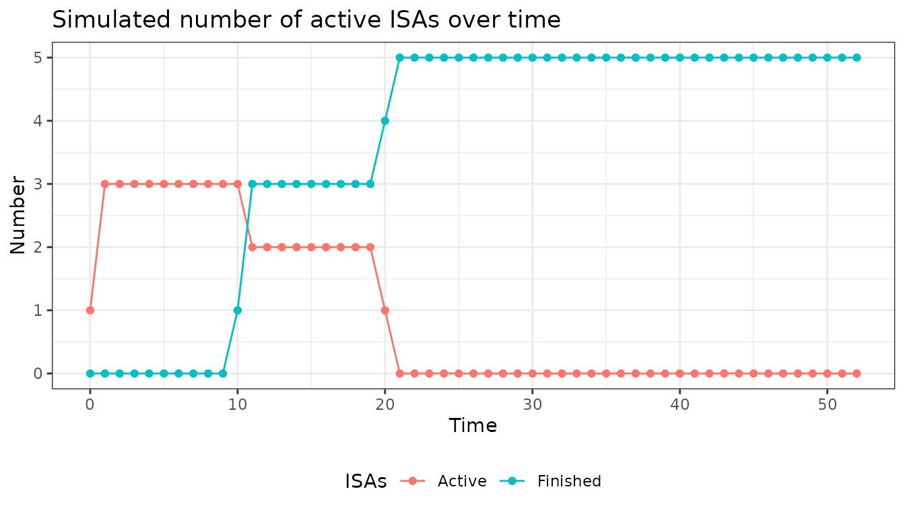

This implements a **“replace as you go”** strategy: whenever an ISA
completes (after 10 weeks by default), a new one enters, up to a maximum
of 5 total ISAs.

### Interpreting the Plot

The plot shows:

- **Blue line**: Number of active (enrolling) ISAs over time
- **Red line**: Number of finished ISAs over time
- **Pattern**: ISAs enter, run for their duration, then finish, making
  room for new ones

## How lNewIntr Works

### Module Structure

The `lNewIntr` module has two components:

**1. `$fnNewIntr`** - A function that decides how many new ISAs to add
at the current time

- **Input**: `lPltfTrial` (current trial status) and `lAddArgs` (your
  custom parameters)
- **Output**: Integer number of ISAs to add (usually 0, 1, or 2)
- **Called**: At every simulation time step

**2. `$lAddArgs`** - A list of parameters your function needs

- Examples: maximum capacity, waiting periods, probabilities

### Available Information

At each time point, your `fnNewIntr` function can access trial status:

``` r
lPltfTrial$lSnap$dCurrTime         # Current week/time
lPltfTrial$lSnap$dActvIntr         # Number of currently active ISAs
lPltfTrial$lSnap$vIntrInclTimes    # Vector of entry times for all ISAs
lPltfTrial$lSnap$bInclAllowed      # Whether inclusion is allowed (custom flag)
```

## Common Inclusion Strategies

### Strategy 1: Fixed Schedule

**Add 1 ISA every 6 months (26 weeks)**

``` r
fixed_entry <- new_lNewIntr(
  fnNewIntr = function(lPltfTrial, lAddArgs) {
    # Check if it's been 26 weeks since last ISA was added
    time_since_last <- lPltfTrial$lSnap$dCurrTime - max(lPltfTrial$lSnap$vIntrInclTimes)
    
    if (time_since_last >= lAddArgs$nTimeDiff) {
      return(1)  # Add 1 ISA
    } else {
      return(0)  # Wait
    }
  },
  lAddArgs = list(nTimeDiff = 26)  # 26 weeks = ~6 months
)

plot(fixed_entry, dCurrTime = 1:104)  # Show 2 years
```

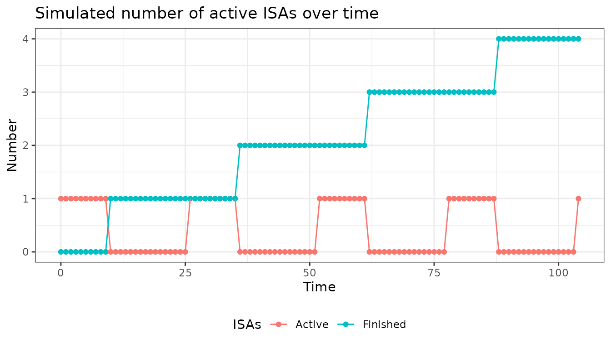

**Use case**: Planned pipeline where treatments arrive on predictable
schedule

### Strategy 2: Capacity-Constrained

**Never exceed 5 concurrent ISAs, add when slots available**

``` r
capacity_limited <- new_lNewIntr(
  fnNewIntr = function(lPltfTrial, lAddArgs) {
    current_active <- lPltfTrial$lSnap$dActvIntr
    max_capacity <- lAddArgs$nIntrMax
    
    if (current_active < max_capacity) {
      # Slot available - add 1 ISA with 40% probability each week
      return(rbinom(1, 1, lAddArgs$prob_inclusion))
    } else {
      return(0)  # At capacity, wait
    }
  },
  lAddArgs = list(
    nIntrMax = 5,
    prob_inclusion = 0.4
  )
)

plot(capacity_limited)
```

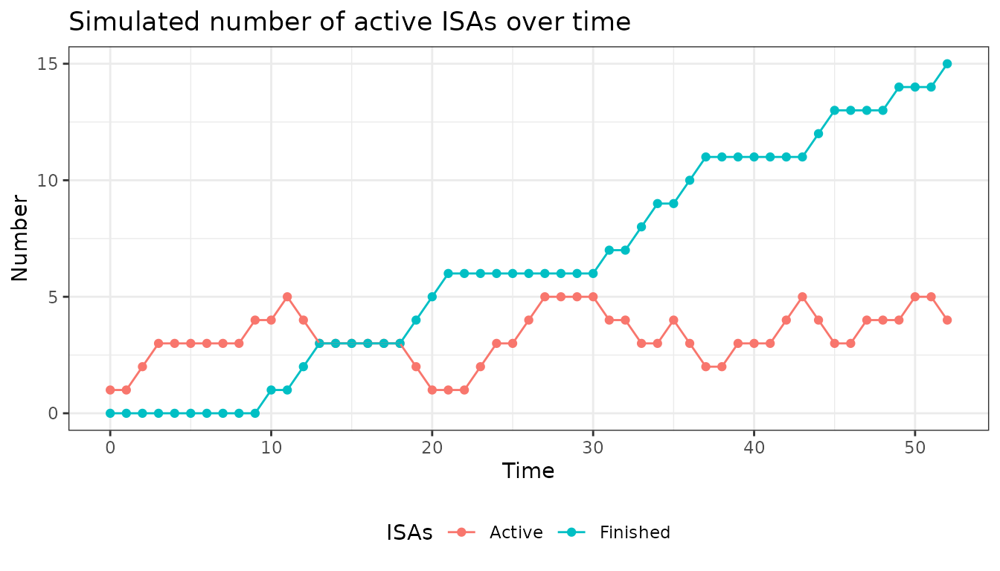

**Use case**: Limited enrollment capacity or operational constraints

### Strategy 3: Burst Entry

**Add multiple ISAs when pipeline releases them**

``` r
burst_entry <- new_lNewIntr(
  fnNewIntr = function(lPltfTrial, lAddArgs) {
    current_active <- lPltfTrial$lSnap$dActvIntr
    max_capacity <- lAddArgs$nIntrMax
    available_slots <- max_capacity - current_active
    
    if (available_slots > 0) {
      # Randomly add 0, 1, or 2 ISAs (but not more than available slots)
      to_add <- sample(0:2, 1, prob = c(0.5, 0.3, 0.2))  # 50% none, 30% one, 20% two
      return(min(to_add, available_slots))
    }
    return(0)
  },
  lAddArgs = list(nIntrMax = 5)
)

plot(burst_entry)
```

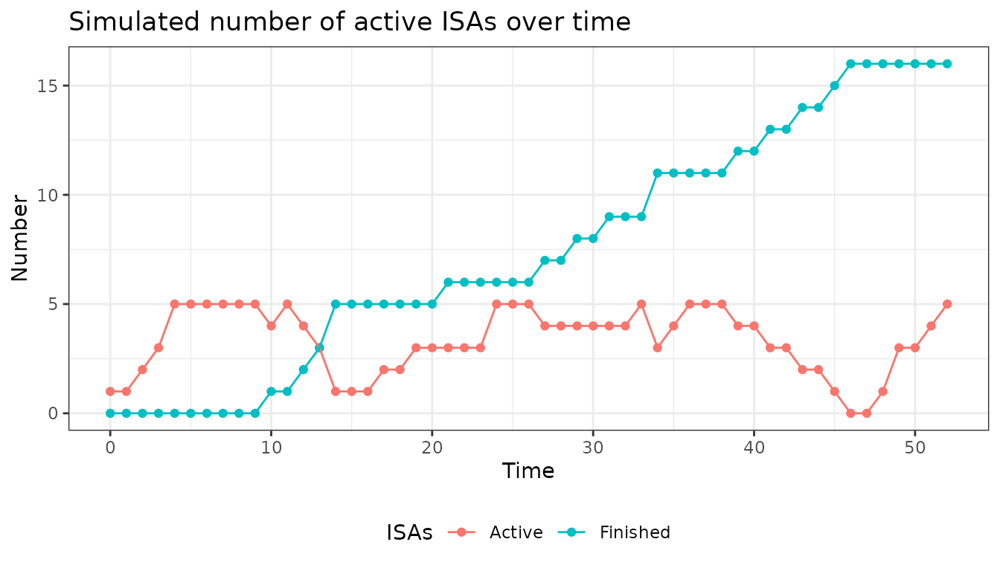

**Use case**: Multiple treatments complete preclinical studies
simultaneously

### Strategy 4: Adaptive Timing

**Vary inclusion probability over time (e.g., ramp up then slow down)**

``` r
adaptive_entry <- new_lNewIntr(
  fnNewIntr = function(lPltfTrial, lAddArgs) {
    current_week <- lPltfTrial$lSnap$dCurrTime
    
    # Different probabilities for different phases
    if (current_week <= 20) {
      prob <- 0.6  # High early on
    } else if (current_week <= 40) {
      prob <- 0.3  # Moderate middle
    } else {
      prob <- 0.1  # Low near end
    }
    
    return(rbinom(1, 1, prob))
  },
  lAddArgs = list()
)

plot(adaptive_entry)
```

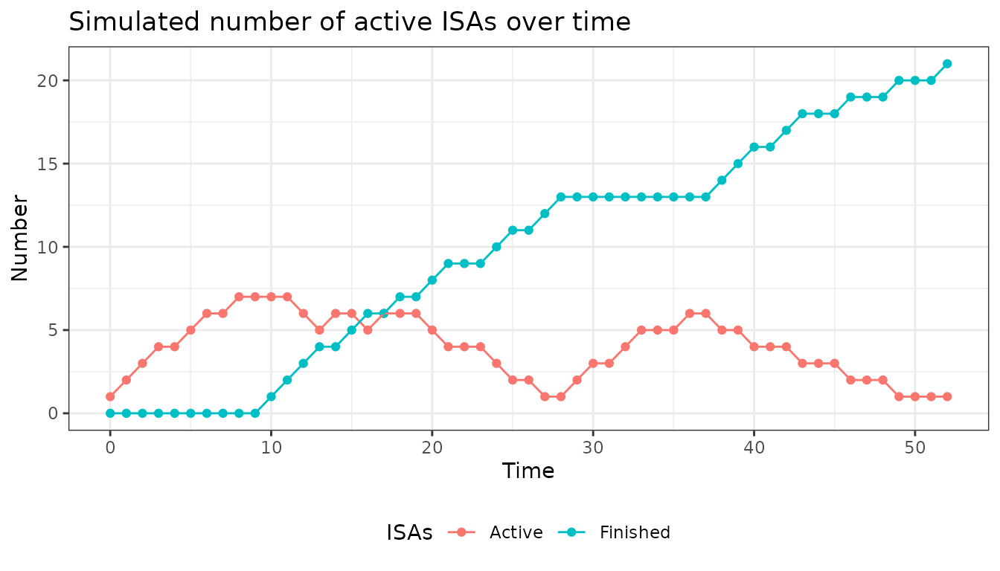

**Use case**: Known pipeline schedule or strategic trial phases

## Realistic Example: Oncology Platform

Imagine designing a platform for novel cancer immunotherapies:

**Requirements**:

- Start with 2 ISAs (treatments already approved for Phase 2)
- Maximum 6 concurrent ISAs (enrollment capacity)
- Add new ISA only after at least 12 weeks (time to assess safety)
- Stop adding after 8 total ISAs evaluated
- ISAs run for variable duration (15-25 weeks until decision)

``` r
oncology_platform <- new_lNewIntr(
  fnNewIntr = function(lPltfTrial, lAddArgs) {
    current_time <- lPltfTrial$lSnap$dCurrTime
    current_active <- lPltfTrial$lSnap$dActvIntr
    total_so_far <- length(lPltfTrial$lSnap$vIntrInclTimes)
    last_entry <- max(lPltfTrial$lSnap$vIntrInclTimes)
    
    # Check all conditions
    weeks_since_last <- current_time - last_entry
    slot_available <- current_active < lAddArgs$max_concurrent
    not_at_total_limit <- total_so_far < lAddArgs$max_total
    waited_long_enough <- weeks_since_last >= lAddArgs$min_wait
    
    # Add 1 ISA if all conditions met
    if (slot_available && not_at_total_limit && waited_long_enough) {
      return(1)
    }
    return(0)
  },
  lAddArgs = list(
    max_concurrent = 6,
    max_total = 8,
    min_wait = 12
  )
)

# Visualize with variable ISA durations
plot(
  oncology_platform,
  nIntrStart = 2,
  dCurrTime = 1:100,
  cIntrTime = "random",
  dIntrTimeParam = 0.05  # ~5% chance of completing each week (avg 20 weeks)
)
```

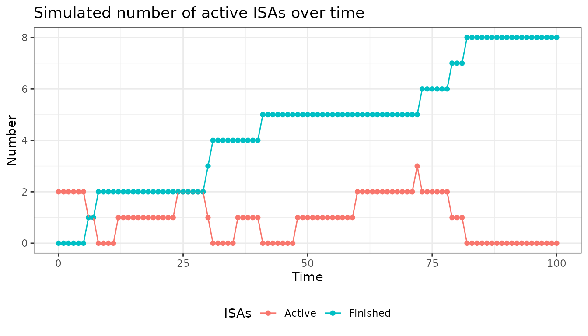

## Function Reference

### Helper Function: `lNewIntr()`

**Quick setup for common “replacement” pattern**

``` r
lNewIntr(
  nMaxIntr,    # Maximum total number of ISAs to evaluate
  nStartIntr   # Number of ISAs to start with
)
```

**Returns**: An `lNewIntr` object that replaces finished ISAs with new
ones

### Constructor: `new_lNewIntr()`

**Full control with custom logic**

``` r
new_lNewIntr(
  fnNewIntr = function(lPltfTrial, lAddArgs) {
    # Your custom logic here
    # Return: integer number of ISAs to add
  },
  lAddArgs = list(...)  # Your custom parameters
)
```

#### Plot

Plotting objects created by `lNewIntr` or `new_lNewIntr` displays the
number of active and finished interventions over time.

There are a few global variables that this specific plot function
requires. `dCurrTime` states the current time point and needs to start
with 1. `cIntrTime` and `dIntrTimeParam` describe the in-trial-time of
interventions. Depending on the input for `cIntrTime` the function
expects different types of input for `dIntrTimeParam`:

- `cIntrTime` = “fixed”
  - `dIntrTimeParam` $\in {\mathbb{N}}$
  - natural number determining how many time units interventions stay in
    the trial
- cIntrTime\` = “random”
  - `dIntrTimeParam` $\in (0,1)$
  - probability of an ISA leaving the trial at every time step

By default ISA’s leave after 10 time units which means that `cIntrTime`
is “fixed” with `dIntrTimeParam` 10.

For the actual plot you just call
[`plot()`](https://rdrr.io/r/graphics/plot.default.html) with the object
you want to plot.

``` r
x <- lNewIntr(nMaxIntr = 5, nStartIntr = 2)
plot(x)
```


Any changes in global variables can be specified in the plot call. If
you are only interested in 20 time steps rather than 52 and want trials
to leave with a probability of 0.2 every time step you can call:

``` r
x <- lNewIntr(nMaxIntr = 10, nStartIntr = 2)
plot(
  x,
  dCurrTime = 1:20,
  cIntrTime = "random",
  dIntrTimeParam = 0.2
)
```

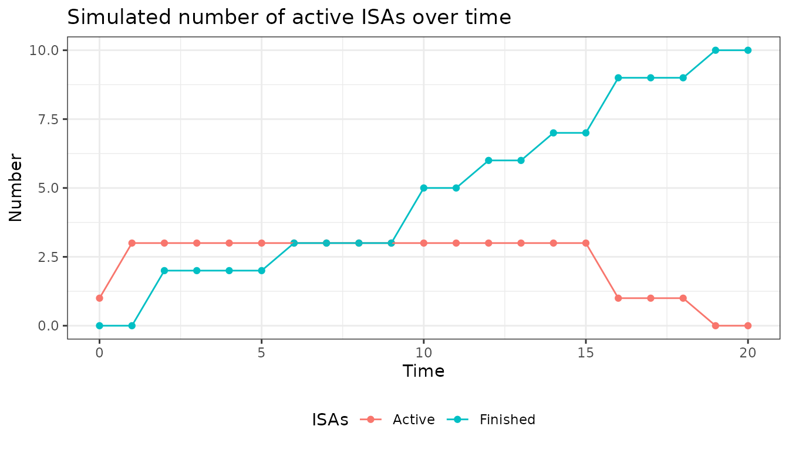

Optionally you can also state the global variables you added in the
object created by the `new_lRecrPars` function.

#### Summary

The summary call provides information about the input you provided. It
gives an overview about snapshot and additional variables as well the
function that was implemented.

``` r
summary(x)
```

    ## Specified inclusion function: 
    ## [1] "if (is.null(lAddArgs$vArrTimes)) {\n    if (lPltfTrial$lSnap$dCurrTime == 1) {\n        dAdd <- lAddArgs$nStartIntr\n    }\n    else if (lPltfTrial$lSnap$dExitIntr > 0 & length(lPltfTrial$lSnap$vIntrInclTimes) < lAddArgs$nMaxIntr) {\n        dAdd <- min(lAddArgs$nMaxIntr - length(lPltfTrial$lSnap$vIntrInclTimes), lPltfTrial$lSnap$dExitIntr)\n    }\n    else {\n        dAdd <- 0\n    }\n} else {\n    dAdd <- sum(lPltfTrial$lSnap$dCurrTime == lAddArgs$vArrTimes)\n}"
    ## 
    ##  Specified arguments: 
    ## $nMaxIntr
    ## [1] 10
    ## 
    ## $nStartIntr
    ## [1] 2
    ## 
    ## $vArrTimes
    ## NULL

### Examples

1.  **Replace outgoing ISAs with helper function**

``` r
x <- lNewIntr(nMaxIntr = 4, nStartIntr = 2)
# in default version, replace every outgoing ISA until a maximum number of ISAs (in this case 4)
plot(x)
```

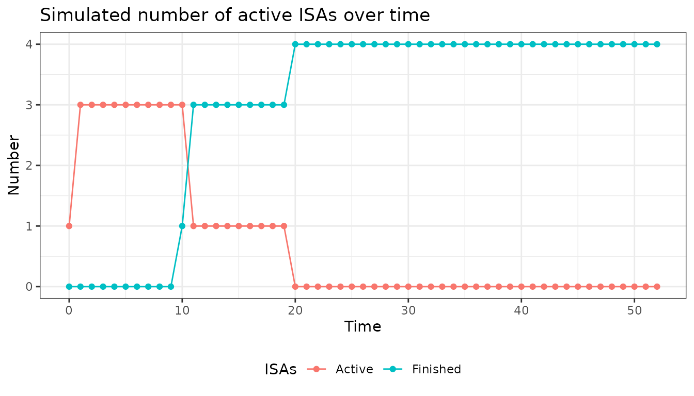

``` r
# default plot assumes an in-trial time for ISAs of 10 time steps
summary(x)
```

    ## Specified inclusion function: 
    ## [1] "if (is.null(lAddArgs$vArrTimes)) {\n    if (lPltfTrial$lSnap$dCurrTime == 1) {\n        dAdd <- lAddArgs$nStartIntr\n    }\n    else if (lPltfTrial$lSnap$dExitIntr > 0 & length(lPltfTrial$lSnap$vIntrInclTimes) < lAddArgs$nMaxIntr) {\n        dAdd <- min(lAddArgs$nMaxIntr - length(lPltfTrial$lSnap$vIntrInclTimes), lPltfTrial$lSnap$dExitIntr)\n    }\n    else {\n        dAdd <- 0\n    }\n} else {\n    dAdd <- sum(lPltfTrial$lSnap$dCurrTime == lAddArgs$vArrTimes)\n}"
    ## 
    ##  Specified arguments: 
    ## $nMaxIntr
    ## [1] 4
    ## 
    ## $nStartIntr
    ## [1] 2
    ## 
    ## $vArrTimes
    ## NULL

------------------------------------------------------------------------

2.  **Add an intervention every 4 time units**

``` r
x <- 
  new_lNewIntr(
    fnNewIntr  = function(lPltfTrial, lAddArgs) {
      # if it has been 4 time units since last inclusion, add one ISA
      if (lPltfTrial$lSnap$dCurrTime == max(lPltfTrial$lSnap$vIntrInclTimes) + lAddArgs$nTimeDiff) {
        dAdd <- 1
      } else {
        dAdd <- 0
      }
      return(dAdd)
    },
    lAddArgs      = list(nTimeDiff = 4)
  )
plot(x)
```

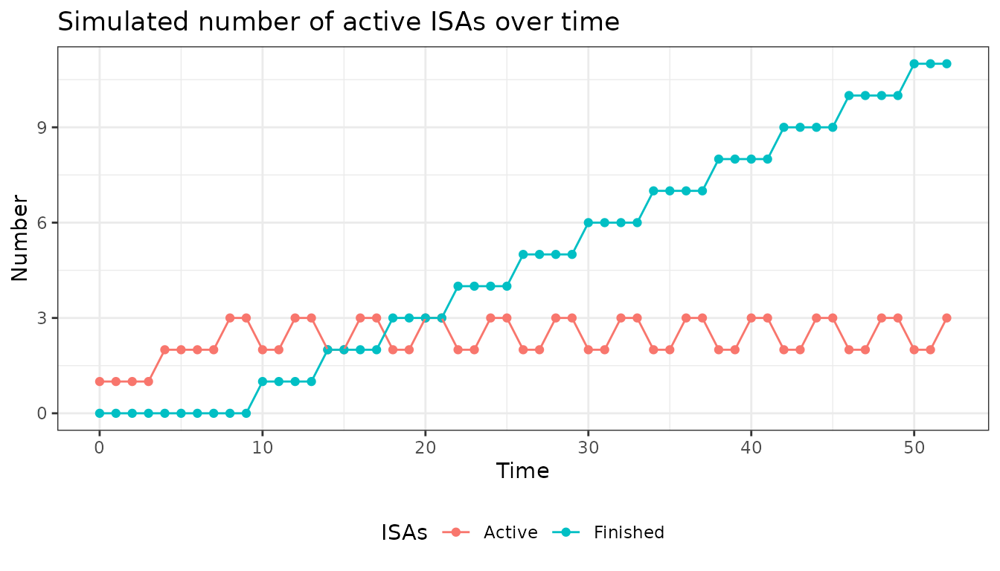

``` r
summary(x)
```

    ## Specified inclusion function: 
    ## [1] "if (lPltfTrial$lSnap$dCurrTime == max(lPltfTrial$lSnap$vIntrInclTimes) + lAddArgs$nTimeDiff) {\n    dAdd <- 1\n} else {\n    dAdd <- 0\n}"
    ## 
    ##  Specified arguments: 
    ## $nTimeDiff
    ## [1] 4

------------------------------------------------------------------------

3.  **Random entry of ISAs, add max 2 at a time, maximum 5 parallel**

``` r
# Add ISAs with random probability
# never more than two at the same time and never allow more than 5 to run in parallel

x <- 
  new_lNewIntr(
    fnNewIntr  = function(lPltfTrial, lAddArgs) {
      
      if (lPltfTrial$lSnap$dActvIntr < lAddArgs$nIntrMax) {
        dAdd <- min(rbinom(1, 3, lAddArgs$prob_inclusion), lAddArgs$nIntrMax - lPltfTrial$lSnap$dActvIntr)
      } else {
        dAdd <- 0
      }
      return(min(2, dAdd))
    },
    lAddArgs      = list(
      nIntrMax = 5,
      prob_inclusion = 0.4
    )
  )
plot(x)
```

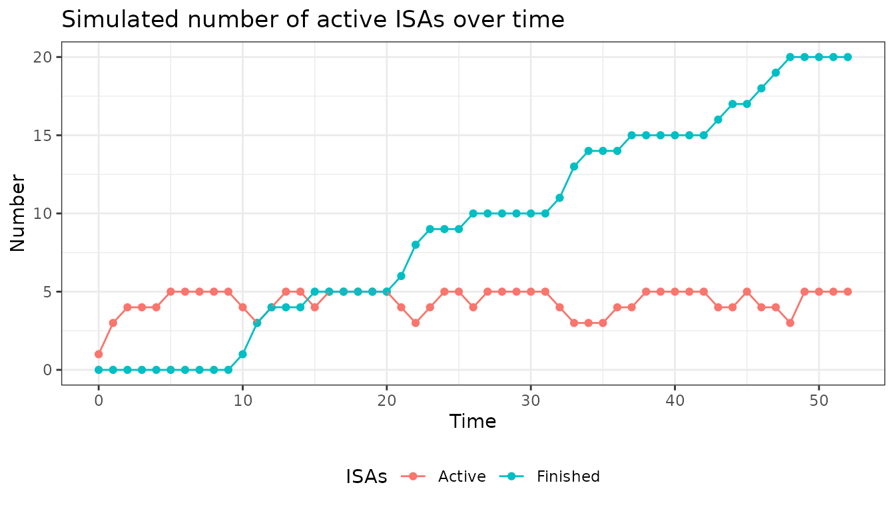

``` r
summary(x)
```

    ## Specified inclusion function: 
    ## [1] "if (lPltfTrial$lSnap$dActvIntr < lAddArgs$nIntrMax) {\n    dAdd <- min(rbinom(1, 3, lAddArgs$prob_inclusion), lAddArgs$nIntrMax - lPltfTrial$lSnap$dActvIntr)\n} else {\n    dAdd <- 0\n}"
    ## 
    ##  Specified arguments: 
    ## $nIntrMax
    ## [1] 5
    ## 
    ## $prob_inclusion
    ## [1] 0.4

------------------------------------------------------------------------

4.  **As before, with inclusion stop for some time points**

``` r
x <- 
  new_lNewIntr(
    fnNewIntr  = function(lPltfTrial, lAddArgs) {

      if (lPltfTrial$lSnap$dActvIntr < lAddArgs$nIntrMax & lPltfTrial$lSnap$bInclAllowed) {
        dAdd <- min(rbinom(1, 3, lAddArgs$prob_inclusion), lAddArgs$nIntrMax - lPltfTrial$lSnap$dActvIntr)
      } else {
        dAdd <- 0
      }
      return(min(2, dAdd))
    },
    lAddArgs      = list(
      nIntrMax = 5,
      prob_inclusion = 0.4
    )
  )
plot(
  x,
  bInclAllowed = c(
    rep(TRUE, 15), 
    rep(FALSE, 15), 
    rep(TRUE, 22)
  )
)
```

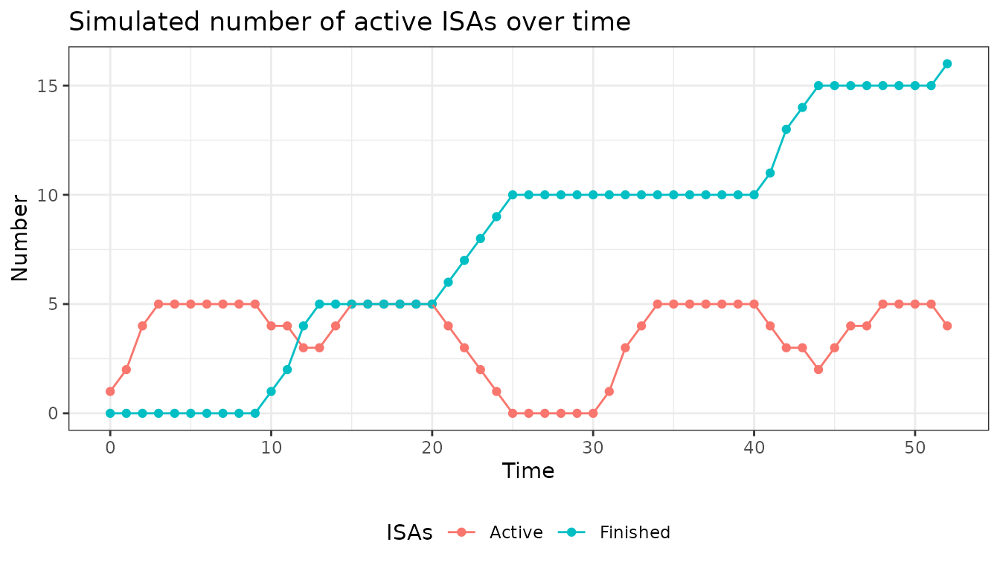

``` r
summary(x)
```

    ## Specified inclusion function: 
    ## [1] "if (lPltfTrial$lSnap$dActvIntr < lAddArgs$nIntrMax & lPltfTrial$lSnap$bInclAllowed) {\n    dAdd <- min(rbinom(1, 3, lAddArgs$prob_inclusion), lAddArgs$nIntrMax - lPltfTrial$lSnap$dActvIntr)\n} else {\n    dAdd <- 0\n}"
    ## 
    ##  Specified arguments: 
    ## $nIntrMax
    ## [1] 5
    ## 
    ## $prob_inclusion
    ## [1] 0.4

------------------------------------------------------------------------

5.  **Different probabilities of inclusion for different time points**

``` r
# Every 7th time step the probability for inclusion of an arm is increased
x <- new_lNewIntr(
  fnNewIntr = function(lPltfTrial, lAddArgs) {
    if(lPltfTrial$lSnap$dCurrTime %% 7 == 0){
      dAdd <- sample(c(1,0), 1, prob = c(lAddArgs$prob_incl_1, 1-lAddArgs$prob_incl_1))
    } else {
      dAdd <- sample(c(1,0), 1, prob = c(lAddArgs$prob_incl_2, 1-lAddArgs$prob_incl_2))
    }
    return(dAdd)
  },
  
  lAddArgs = list(prob_incl_1 = 0.8, prob_incl_2 = 0.1)
)

plot(x)
```

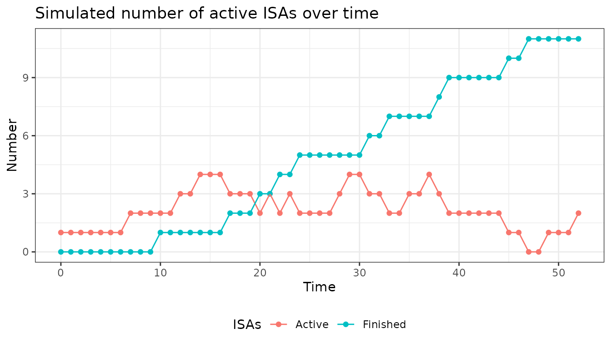

------------------------------------------------------------------------

6.  **Random end of ISAs**

``` r
# Now the end of ISAs is not after a fixed interval but is randomly drawn
# On average every 5 days an arm enters, and every 10 days an arm leaves

x <- new_lNewIntr(
  fnNewIntr = function(lPltfTrial, lAddArgs) {
    dAdd <- sample(c(1,0), 1, prob = c(lAddArgs$prob_incl, 1-lAddArgs$prob_incl))
    
    return(dAdd)
  },
  lAddArgs = list(prob_incl = 0.2)
)

plot(
  x,
  cIntrTime = "random",
  dIntrTimeParam = 0.1
)
```

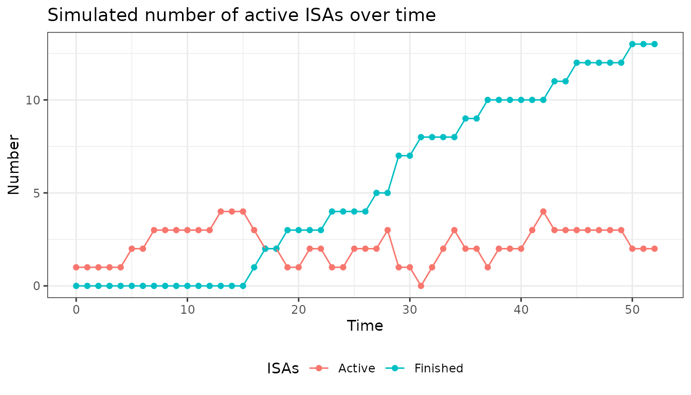

## Exercises

Below will be some tasks of increasing complexity to make you
comfortable using the module and figure out difficulties.

### Tasks

Try to use the module to program the following tasks according to the
instructions. The solutions are given below. The examples of the
vignette may serve as a helping hand. The plots below show what the
plotted output could look like.

**1. With a 50:50 % chance let 1 or 2 ISAs enter every 5th time unit and
let the maximum number of total ISAs be 10.**

``` r
x <- new_lNewIntr(
  fnNewIntr = function(lPltfTrial, lAddArgs){
    
    # if the conditions are met (every 5th time unit & there are less than 10 ISAs so far) we randomly draw 1 or 2 to determine how many ISAs should be added
    if((lPltfTrial$lSnap$dCurrTime %% 5 == 0) & (length(lPltfTrial$lSnap$vIntrInclTimes) < lAddArgs$nIntrMax)){
      dAdd <- sample(c(1,2), 1)
    } else {
      
      # otherwise no ISA is added
      dAdd <- 0
    }
      
  },
  
  # here we set the maximum number of total interventions to 10
  lAddArgs = list(nIntrMax = 10)
)

plot(x)
```

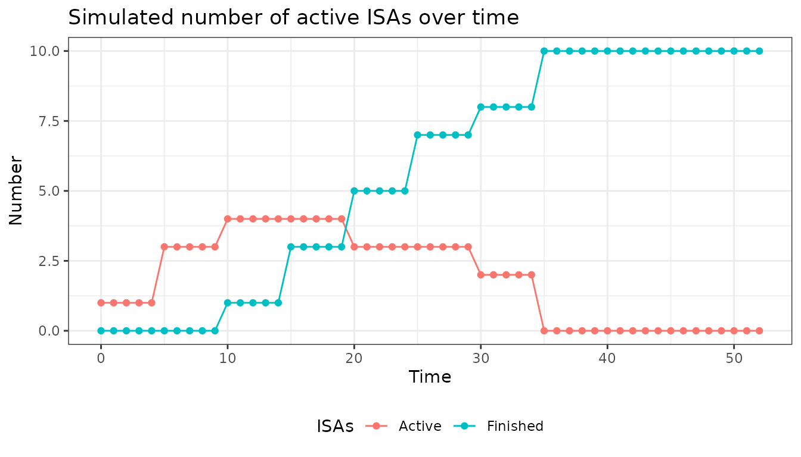

**2. Let the entry of ISAs be random, with an entry probability of 0.2
at each time step, the maximum number of total ISAs be 6 and the maximum
number of parallel ISAs be 3. For visualization, let the ISAs duration
be 12.**

\*Hint: duration of ISAs is specified in the plot function, as this is
not a feature of the lNewIntr module.

``` r
x <- new_lNewIntr(
  fnNewIntr = function(lPltfTrial, lAddArgs){
    # if the conditions are met (number of parallel ISAs <3, number of total ISAs < 6) we randomly draw if an ISA is added with the stated probabilities
    if((length(lPltfTrial$lSnap$IntrInclTimes) < lAddArgs$nIntrMax) & (lPltfTrial$lSnap$dActvIntr < lAddArgs$nIntrParallel)){
      dAdd <- sample(c(1,0), 1, prob = c(lAddArgs$prob, 1-lAddArgs$prob))
    } else {
      dAdd <- 0
    }
    
    return(dAdd)
  },
  
  # here the additional arguments are specified (max number of parallel interventions, max number of total interventions, entry probability)
  lAddArgs = list(
    nIntrParallel = 3,
    nIntrMax = 6,
    prob = 0.2
  )
)


# here we set the duration of interventions to be fixed (intr_itt) with duration 12 (intr_itt_param)
plot(
  x,
  cIntrTime = "fixed",
  dIntrTimeParam = 12
)
```

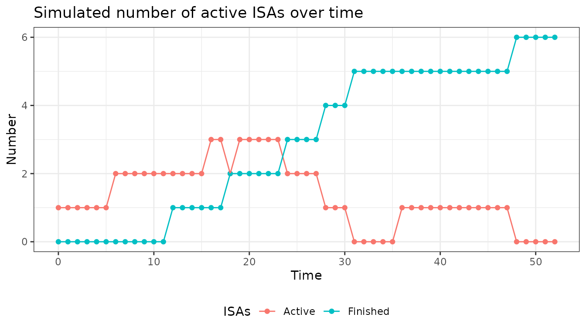

**3. Let the entry and exit of ISAs be random with probabilities 0.2 and
0.1 respectively. Only consider a simulation period of 40 timesteps
instead of the default of 52. Additionally no recruitment should happen
between time unit 10 and 20.**

\*Hint: the number of time steps, recruitment window and exit
probability are specified in the plot function, as these are not
features of the lNewIntr module.

``` r
x <- new_lNewIntr(
  
  fnNewIntr = function(lPltfTrial, lAddArgs){
    if(lPltfTrial$lSnap$bInclAllowed){
      dAdd <- sample(c(1,0), 1, prob = c(lAddArgs$prob, 1-lAddArgs$prob))
    } else {
      dAdd <- 0
    }
      return(dAdd)
    },
  
  lAddArgs = list(prob = 0.2)
  
)

# here we set the arguments which are not part of the lNewIntr module, but are still specified
# we have to state that the exit of ISAs is random (intr_itt) with a probability of 0.1 (intr_itt_param) at each time step. Additionally we change the simulation duration (dCurrTime) to 40 time steps and define the enrollment window (bInclAllowed).
plot(
  x,
  cIntrTime = "random",
  dIntrTimeParam = 0.1,
  dCurrTime = 1:40,
  bInclAllowed = c(rep(TRUE, 10), rep(FALSE, 10), rep(TRUE, 20)), # has to be a vector of the same length as dCurrTime so that for each time step a value can be taken from the vector
)
```

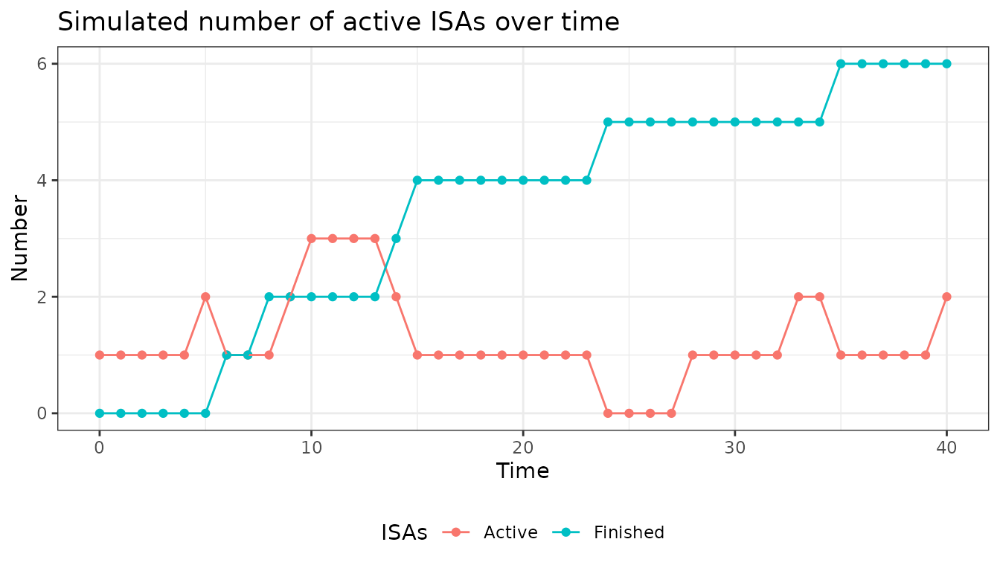

#### Remarks

The snapshot variables saved in the list *lPltfTrial* have a fixed name
which should not be changed as it is implemented in many different
modules. As mentioned above the vignette of the module *lSnap* will
contain an overview of all the snapshot variables used in any module.
